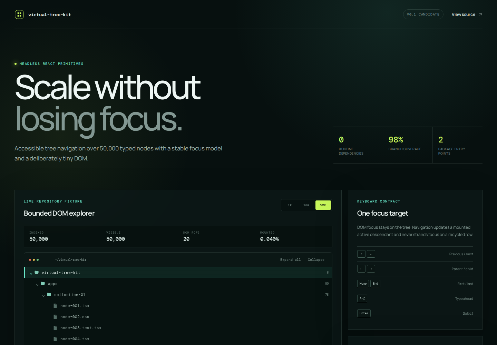

# Virtual Tree Kit

[](https://github.com/wasiliy-strecker/virtual-tree-kit/actions/workflows/ci.yml)
[](https://github.com/wasiliy-strecker/virtual-tree-kit/actions/workflows/browser.yml)
[](https://github.com/wasiliy-strecker/virtual-tree-kit/releases)
[](LICENSE)

Headless, accessible virtualized tree primitives for React, built for large
hierarchies and predictable keyboard focus.

[**Open the interactive 50,000-node demo →**](https://wasiliy-strecker.github.io/virtual-tree-kit/)

[](https://wasiliy-strecker.github.io/virtual-tree-kit/)

## Why this exists

Large tree views combine two concerns that are easy to get wrong together:
recycling most DOM rows while keeping keyboard focus meaningful to assistive
technology. Virtual Tree Kit keeps focus on one stable container and only
publishes an `aria-activedescendant` after that row is mounted.

- **Bounded DOM:** 50,000 visible nodes render at most 24 rows in the demo.
- **Complete keyboard model:** arrows, Home, End, Enter, Space, and wrapping
  accent-insensitive typeahead.
- **Typed adapters:** application data keeps its original generic type.
- **Headless first:** prop getters own behavior while the product owns visuals.
- **Framework-independent core:** indexing, navigation, and range math are
  available from `virtual-tree-kit/core`.
- **Zero runtime dependencies:** React is a peer dependency.

## Install

The `v0.1.0` package is attached to the GitHub release:

```bash
pnpm add https://github.com/wasiliy-strecker/virtual-tree-kit/releases/download/v0.1.0/virtual-tree-kit-0.1.0.tgz
```

React 18.3 and React 19 are supported.

## Quick start

```tsx
import { VirtualTree } from 'virtual-tree-kit'

interface FileNode {
  readonly children: readonly FileNode[]
  readonly name: string
  readonly path: string
}

export function FileTree({ files }: { files: readonly FileNode[] }) {
  return (
    <VirtualTree
      ariaLabel="Repository files"
      defaultExpandedIds={['src']}
      getChildren={(file) => file.children}
      getId={(file) => file.path}
      getTextValue={(file) => file.name}
      items={files}
      overscan={4}
      renderItem={({ isSelected, item }) => (
        <span data-selected={isSelected || undefined}>{item.name}</span>
      )}
      rowHeight={32}
      viewportHeight={480}
    />
  )
}
```

Use `useVirtualTree` instead when the application needs complete control over
markup, disclosure affordances, and styling. The hook returns the indexed
collection, visible projection, mounted rows, state, imperative actions, and
prop getters.

## Package surface

| Import                  | Purpose                                                      |
| ----------------------- | ------------------------------------------------------------ |
| `virtual-tree-kit`      | `useVirtualTree`, `VirtualTree`, and all public React types  |
| `virtual-tree-kit/core` | Immutable collection, navigation, typeahead, and virtualizer |

Both ESM and CommonJS consumers receive matching declaration files. The release
pipeline checks the packed artifact with Publint, Are the Types Wrong, and
compile-time public API tests.

## Behavior contract

- Active focus and selection are separate.
- Expansion and selection can each be controlled or uncontrolled.
- Collapsing a branch moves an invisible active descendant to its nearest
  visible ancestor.
- Unknown IDs are ignored by imperative selection, expansion, and scroll
  operations.
- Empty trees remain focusable and omit `aria-activedescendant`.
- Fixed row height makes mounting and scroll alignment deterministic.

Read the [React contract](docs/react-contract.md) and
[framework-independent core contract](docs/core-contract.md) for the exact API,
state ownership, complexity, and error semantics.

## Evidence

The default showcase projects 50,000 visible nodes into a maximum of 24 mounted
rows and a 1,600,000 px virtual scroll extent. Browser tests exercise keyboard
focus, typeahead, selection, resizing, and collapse behavior in Chromium. A
full-page Axe scan runs without rule exclusions.

Unit and property tests enforce 95% global coverage thresholds. The current
suite reports 98.12% branch coverage and package validation runs across Node
22, 24, and 26.

See [scale and browser evidence](docs/scale-evidence.md) for the testable claims
and reproduction commands.

## Deliberate v0.1 scope

The first release covers fixed-height rows, single selection, synchronous
hierarchies, and one stable tree focus target. Multi-selection, drag-and-drop,
variable heights, asynchronous child loading, and focusable controls inside
rows are intentionally not implied.

## Development

Requirements are Node.js 22.12 or newer and pnpm 11.

```bash
corepack enable
pnpm install --frozen-lockfile
pnpm verify
pnpm demo:dev
```

Install Chromium once and run the browser evidence with:

```bash
pnpm exec playwright install chromium
pnpm test:e2e
```

See [CONTRIBUTING.md](CONTRIBUTING.md) and [CHANGELOG.md](CHANGELOG.md).

## License

[MIT](LICENSE)
